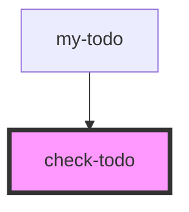

# check-todo

<!-- Auto Generated Below -->

## Properties

| Property            | Attribute | Description | Type      | Default     |
| ------------------- | --------- | ----------- | --------- | ----------- |
| `done` _(required)_ | `done`    |             | `boolean` | `undefined` |
| `n` _(required)_    | `n`       |             | `number`  | `undefined` |
| `text` _(required)_ | `text`    |             | `string`  | `undefined` |

## Events

| Event  | Description | Type                  |
| ------ | ----------- | --------------------- |
| `todo` |             | `CustomEvent<number>` |

## Dependencies

### Used by

 - [my-todo](../my-todo)

### Graph

----------------------------------------------

*Built with [StencilJS](https://stenciljs.com/)*
